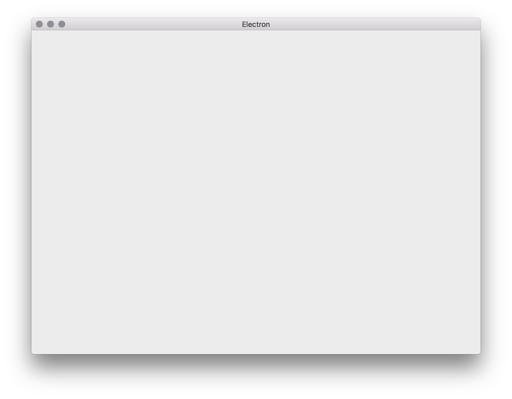
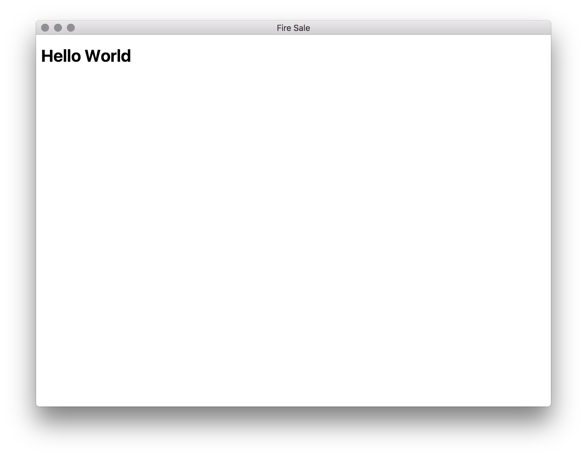
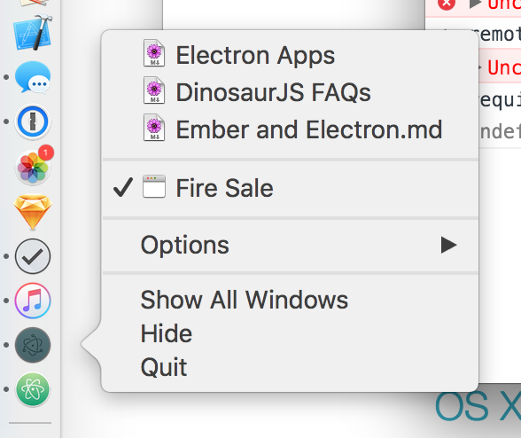

# Build cross-platform desktop apps with Electron

This is a workshop for learning how to build cross platform desktop apps with JavaScript, HTML, and CSS. We'll be using [Electron](http://electron.atom.io/) to accomplish this.

## Motivation

To help get you excited, take a look at some of the amazing apps that have already been built with Electron:

| Atom | Slack | Visual Studio Code | Nylas N1 |
|---|---|---|---|
| [](https://atom.io/) | [](https://slack.com/) | [](https://code.visualstudio.com/) | [](https://www.nylas.com/) |

| WebTorrent | Brave | Hyper | Caprine |
|---|---|---|---|
| [](https://webtorrent.io/) | [](https://brave.com/) | [](https://hyper.is/) | [](https://github.com/sindresorhus/caprine) |

| Keeweb | CryptoCat | ScreenCat | Playback |
|---|---|---|---|
| [](https://keeweb.info/) | [](https://crypto.cat/) | [](http://maxogden.github.io/screencat/) | [](https://mafintosh.github.io/playback/) |

For more, take a look at this [huge list of Electron apps](http://electron.atom.io/apps/).

## Credit

Vast portions of this workshop are based on a similar [workshop](https://gist.github.com/stevekinney/d1abe98d2f4f8cfae403cb86b7963a41) created by Steve Kinney. If you like it, check out his book [Electron In Action](https://www.manning.com/books/electron-in-action).

## Prerequisites

Participants should have the latest version of [Node.js](http://nodejs.org/) installed. (The latest version is v6.x LTS.)

We'll primarily be working through one project today. But there is a second one, which is an opportunity to practice on your own after the workshop. The _best_ way to get set up and ready to roll before the workshop is to clone this repository and run `npm install` within it.

# Markdown Editor

This is a tutorial for building a Markdown-to-HTML renderer using Electron. The final app will be similar to [Markdownify](http://www.amitmerchant.com/electron-markdownify/).

## Table of contents

- [Getting Started and Acclimated](#getting-started-and-acclimated)
- [Challenge 1: Hello World](#challenge-1-hello-world)
  - [Firing Up a Renderer Process](#firing-up-a-renderer-process)
  - [Optional: Learn something extra!](#optional-learn-something-extra)
- [Challenge 2: Opening a File](#challenge-2-opening-a-file)
  - [Sending Content to the Renderer Process](#sending-content-to-the-renderer-process)
  - [Optional: Learn something extra!](#optional-learn-something-extra)
- [Challenge 3: Writing Renderer Code](#challenge-3-writing-renderer-code)
  - [Displaying Content on the Page](#displaying-content-on-the-page)
  - [Updating the HTML When the Markdown Changes](#updating-the-html-when-the-markdown-changes)
- [Challenge 4: Wiring Up the Buttons](#challenge-4-wiring-up-the-buttons)
  - [Exporting Functionality](#exporting-functionality)
  - [Optional: Learn something extra!](#optional-learn-something-extra)
- [Challenge 5: Working with the Clipboard](#challenge-5-working-with-the-clipboard)
- [Challenge 6: Saving Files](#challenge-6-saving-files)
  - [Optional: Learn something extra!](#optional-learn-something-extra)
- [Challenge 7: Adding Menu Items](#challenge-7-adding-menu-items)
- [Challenge 8: Electron's `shell` Module](#challenge-8-electrons-shell-module)
- [Challenge 9: Appending to the Recent Documents Menu](#challenge-9-appending-to-the-recent-documents-menu)
  - [Optional: Learn something extra!](#optional-learn-something-extra)
- [Challenge 10: Accessing the Outside World](#challenge-10-accessing-the-outside-world)
  - [Activating the Buttons](#activating-the-buttons)
- [Challenge 11: Drag and Drop](#challenge-11-drag-and-drop)
  - [Drag and drop on the window](#drag-and-drop-on-the-window)
  - [Drag and drop on the app icon (Mac)](#drag-and-drop-on-the-app-icon-mac)
- [Challenge 12: More complete OS integrations](#challenge-12-more-complete-os-integrations)
- [Challenge 13: Package the app](#challenge-13-package-the-app)
- [Challenge 14: Go crazy!](#challenge-14-go-crazy)

## Getting Started and Acclimated

To get started, clone this repository and install the dependencies using `npm install`.

We'll be working with four files for the duration of this tutorial:

- `lib/main.js`, which will contain code for the main process
- `lib/renderer.js`, which will code for the renderer process
- `lib/index.html`, which will contain the HTML for the user interface
- `lib/style.css`, which will contain the CSS to style the user interface

In a more robust application, you might break stuff into smaller files, but—for the sake of simplicity—we're not going to.

## Challenge 1: Hello World

Now that we have our dependencies and some basic files, let's get our Electron application to the point where we can launch it.

Everything in Electron lives inside of the `electron` library. Let's start by requiring it inside of `main.js`.

```js
const electron = require('electron')
```

Electron contains many [modules][] that we'll use for building our application. The first—and arguably, most important—that we're going to need is the `app` module. All modules exist as properties on the `electron` object. We're going to be using the `app` module pretty often, so let's store it in its own variable.

[modules]: http://electron.atom.io/docs/

```js
const electron = require('electron')
const app = electron.app
```

The [`app`][app] module has a number of life-cycle events. Here are a few examples:

[app]: http://electron.atom.io/docs/api/app/

- `ready`
- `quit`
- `before-quit`
- `will-quit`
- `window-all-closed`

Right now, displaying a user interface when the application is `ready` is our primary concern. So, we'll listen for the `ready` event.

```js
const electron = require('electron')
const app = electron.app

app.on('ready', () => {
  console.log('The application is ready.')
})
```

There isn't much to look at yet, but if we run `npm start`, you should notice the following.

1. Our message is logged to the console.
1. An Electron icon pops up in the Dock.

Hit `Control-C` to kill the application.

Note: The `npm start` command is just running `electron .` for you. You can use `electron .` directly, but you will need to install electron
globally with `npm install -g electron`. In general, it's better to just use the locally-installed `electron` binary. If you're curious, that binary exists at `node_modules/.bin/electron`.

### Firing Up a Renderer Process

Now that we can spin up our application, it's time to go ahead and build a user interface. In order to create a window for our application, we'll need to pull in the [`BrowserWindow`](http://electron.atom.io/docs/api/browser-window/) module.

```js
const BrowserWindow = electron.BrowserWindow
```

We'll create the main window for our application when the application is ready. That said, we need to declare a variable to store our main window in the top level scope. This is due to the combination of two facts:

1. JavaScript has function scopes.
1. Our `ready` event listener is a function.

If we declared the `mainWindow` variable in our event listener, it would be eligible for garbage collection as soon as that function is done executing, which is bad news. We'll declare `mainWindow` in the top-level scope.

To avoid this, we'll update `main.js` as follows:

```js
const electron = require('electron')
const app = electron.app
const BrowserWindow = electron.BrowserWindow

let mainWindow = null

app.on('ready', () => {
  console.log('The application is ready.')

  mainWindow = new BrowserWindow()

  mainWindow.on('closed', () => {
    mainWindow = null
  })
})
```

If the user ever closes the window, we'll set the `mainWindow` back to `null`.

Let's take our application for a spin again by running `npm start` from the command line. You should see something resembling the image below.



Let's actually load some content, shall we?

Make sure you require the `path` module towards the beginning of `main.js`:

```js
const path = require('path')
```

We'll also update the `'ready'` handler as follows:

```js
app.on('ready', () => {
  console.log('The application is ready.')

  mainWindow = new BrowserWindow()

  mainWindow.loadURL('file://' + path.join(__dirname, 'index.html'))

  mainWindow.on('closed', function() {
    mainWindow = null
  })
})
```

In the code above, `__dirname` is a globally-available Node variable that references the current directory that Node is running from. In this case, we're executing `./lib/main.js`, so `__dirname` is the `lib` directory relative to where ever you installed this repository.



### Optional: Learn something extra!

These tasks are totally optional, but highly recommended to learn about some of Electron's more obscure, but powerful features.

1. Set the `width` and `height` of the browser window using options to the [`BrowserWindow`](http://electron.atom.io/docs/api/browser-window/) constructor to change the size of the window.

2. Try to open the window at the top left of the screen, instead of in the center (which is default).

3. Try to change the title of the window. (Electron supports two ways of setting the window title. There is a `BrowserWindow` constructor option, but if none is specified, then the `<title>` tag in the HTML will be used.

4. Try to make the window "float on top" so no other windows can be drawn above it.

5. Try to make the window ["frameless"](http://electron.atom.io/docs/api/frameless-window/). How will you allow the user to move around a frameless window if there's no title bar?

## Challenge 2: Opening a File

One of the big motivations for building an Electron application is the promise of being able to do stuff we wouldn't normally be able to do in the browser. Prime examples are activating native OS dialogs and accessing the filesystem.

Actions like accessing the filesystem and calling native dialogs and menus are best handled by the main process. That said, we're eventually going to need to display the results in our renderer process as well as add buttons to our user interface for initiating the process of opening a file.

Let's start by adding some elements to the user interface for displaying our content once it's loaded.

In `index.html`, replace the contents of `<body>` with the following:

```html
<section class="controls">
  <button id="open-file">Open File</button>
  <button id="copy-html">Copy HTML</button>
  <button id="save-file">Save HTML</button>
</section>

<section class="content">
  <textarea class="raw-markdown"></textarea>
  <div class="rendered-html"></div>
</section>
```

We'll start by prompting the user for a file to open when the application is ready. In order to make this happen, we'll need Electron's `dialog` module. Add the following to `main.js` just below where we require our other Electron modules.

```js
const dialog = electron.dialog
```

We're going to want to reuse this functionality, so we'll break it out into its own function.

```js
function openFile () {
  const files = dialog.showOpenDialog(mainWindow, {
    properties: ['openFile']
  })

  if (!files) return

  console.log(files)
}
```

We'll call this function immediately once the browser window has loaded. If the user cancels the file open dialog, `files` will be `undefined`. If that happens, we return early so that we don't get any errors down the line.

```js
app.on('ready', () => {
  console.log('The application is ready.')

  mainWindow = new BrowserWindow()

  mainWindow.loadURL('file://' + path.join(__dirname, 'index.html'))

  // This event fires once the browser window's DOM is loaded
  mainWindow.webContents.on('did-finish-load', () => {
    openFile()
  })

  mainWindow.on('closed', function() {
    mainWindow = null
  })
})
```

Right now, we just log the name of the files selected to the console when we open a file. Try it out. You should notice that it's logging an array to the console. In theory, we're only going to want to open one file at a time in our application. So, we'll just grab the first file from the array.

```js
function openFile () {
  const files = dialog.showOpenDialog(mainWindow, {
    properties: ['openFile']
  })

  if (!files) return

  const file = files[0]

  console.log(file)
}
```

Now that we have the location of our file, let's read from that location. `fs.readFileSync` returns a `Buffer` object. We know we're working with text. So, we'll turn that into a string using the `toString()` method.

Make sure you require the `fs` module towards the beginning of `main.js`:

```js
const fs = require('fs')
```

We'll also update `openFile` as follows:

```js
function openFile () {
  const files = dialog.showOpenDialog(mainWindow, {
    properties: ['openFile']
  })

  if (!files) return

  const file = files[0]
  const content = fs.readFileSync(file).toString()

  console.log(content)
}
```

Go ahead and open a text file. You should see the contents of the file logged to the console. With Electron, we can limit the type of files we're willing to open by adding filters to the dialog.

```js
const files = dialog.showOpenDialog(mainWindow, {
  properties: ['openFile'],
  filters: [
    { name: 'Markdown Files', extensions: ['md', 'markdown', 'txt'] }
  ]
})
```

You should now notice that images, PDFs and other assorted files that aren't text files are not available to be selected.

### Sending Content to the Renderer Process

So, we can load files and log them to the terminal. That's great, but it's nothing we couldn't do in Node, right? We need to send the content we've loaded over to the render process.

Instead of logging to the console, let's send the content to the `mainWindow`. Replace the `console.log` in `openFile` with the following:

```js
mainWindow.webContents.send('file-opened', file, content)
```

This won't make anything appear in the window just yet, because we need to handle this event in `renderer.js`, which we'll do in the next challenge!

### Optional: Learn something extra!

1. Try setting a custom label for the confirmation button.

2. Try allowing multiple files to be selected in a single dialog box. See what kind of object gets returned by the callback.

## Challenge 3: Writing Renderer Code

All of the code we've written so far has been in the main process. Now, it's time to write some code in the renderer process to—umm—render our content. Let's load up `renderer.js` by adding the following to `index.html` before `</body>`.

```html
<script>
  require('./renderer')
</script>
```

It's going to be helpful to have access to the Chrome Developer Tools in our renderer process. Let's have Electron pull those up when our browser window loads.

```js
app.on('ready', () => {
  // More code above…

  mainWindow.webContents.openDevTools()

  // More code below…
})
```

(If this is distracting for you, feel free to remove this line, you'll be able to open these tools using the application's menus until we replace them later on this in tutorial.)

The main process and our renderer process are completely separate. In order to facilitate communication between the two, we need to use Electron's interprocess communication (IPC) protocol. In `renderer.js`, we'll require Electron and the `ipcRenderer` module.

```js
const electron = require('electron')
const ipc = electron.ipcRenderer
```

When we load a file, the main process is sending our renderer process a message with the contents over the `file-opened` channel. (This channel name is completely arbitrary and could very well be `sandwich`.) Let's set up a listener.

```js
ipc.on('file-opened', (event, file, content) => {
  console.log(content)
})
```

You should now see the contents of the file you opened in the console of your renderer process.

### Displaying Content on the Page

We'll use a shorthand for `querySelector` in our renderer process to make things
a little more concise. Let's create it in our renderer process as follows:

```js
const $ = selector => document.querySelector(selector)
```

We'll also be a little proactive and cache selectors for our markdown view, rendered HTML view, and buttons.

```js
const $markdownView = $('.raw-markdown')
const $htmlView = $('.rendered-html')
const $openFileButton = $('#open-file')
const $saveFileButton = $('#save-file')
const $copyHtmlButton = $('#copy-html')
```

When the renderer process gets a message on the `file-opened` channel from the main process, we'll display those contents in the `$markdownView` element.

```js
ipc.on('file-opened', (event, file, content) => {
  $markdownView.value = content
})
```

Next, we'll want to take that content, convert it to HTML, and display it in `$htmlView` element. In our `package.json`, we included the [marked] library to take care of the conversion for us. That said, we need to require it in `renderer.js`.

[marked]: https://github.com/chjj/marked

```js
const marked = require('marked')
```

We'll probably want to convert Markdown to HTML in multiple places in our application, so let's do it in a function that we can reuse later if we need to. Add the following to `renderer.js`.

```js
function renderMarkdownToHtml (markdown) {
  const html = marked(markdown)
  $htmlView.innerHTML = html
}
```

The first time we'll probably want to do this is when we load a Markdown file. Update your event listener as follows:

```js
ipc.on('file-opened', (event, file, content) => {
  $markdownView.value = content
  renderMarkdownToHtml(content)
})
```

Open a file in the application and verify that it works.

### Updating the HTML When the Markdown Changes

Whenever the user enters a key in the Markdown view, we'll want to update the HTML view to reflect the current state of the Markdown view. Let's listen for the `keyup` event and reuse our `renderMarkdownToHtml` function.

```js
$markdownView.addEventListener('keyup', (event) => {
  const content = event.target.value
  renderMarkdownToHtml(content)
})
```

## Challenge 4: Wiring Up the Buttons

In our application, we have three buttons in the top bar:

1. Open File
2. Copy HTML
3. Save HTML

It's true that we already have the ability to open a file from within our application—but only from the main process. Generally speaking, renderer processes should _not_ access native OS APIs like spawning file dialogs and whatnot.

So, we're out of luck, right? Not quite. It's true that we can't pull up a file dialog from a render process. But, we _can_ ask the main process to open one up on our behalf.

Electron comes with a `remote` module, which allows us to pull in functionality from other processes. Let's require the `remote` module in `renderer.js`.

```js
const remote = electron.remote
```

Once we have the remote module, we can use it to load up the main process.

```js
const mainProcess = remote.require('./main')
```

### Exporting Functionality

Requiring the main process is not enough. In Node, we need to be explicit about what functionality we're going to export from a module. As of right now, we haven't exported any functionality from `main.js`. We want access to that `openFile` function. So, let's go ahead and export that function in `main.js`.

```js
exports.openFile = openFile
```

Our `openFile` function is now available on the `mainProcess` object in `renderer.js`.

```js
$openFileButton.addEventListener('click', () => {
  mainProcess.openFile()
})
```

When the "Open File" button is clicked, it will call the `openFile` function from the main process and display the file dialog.

It's not necessary, but we can remove the call to `openFile()` when the application starts up now that we have a way to do it from inside the application.

### Optional: Learn something extra!

1. Read the docs for the [`remote`](http://electron.atom.io/docs/api/remote/) module to learn more about how it actually works under the hood using IPC, and what the gotchas are.

2. How can using the `remote` package result in a memory leak if you're not careful?

## Challenge 5: Working with the Clipboard

Now that we have the first button in place, we'll go ahead and get the second button working.

The second button is labeled "Copy HTML." When it's working it should take the rendered HTML output and write it to the clipboard. It shouldn't be surprising to you when I say that Electron has a `clipboard` module that makes it easy to work with the clipboard. Because it works with the OS's clipboard, we'll require it from the main process.

Let's require the `clipboard` module in `renderer.js`:

```js
const clipboard = remote.clipboard
```

When the user clicks on the "Copy HTML" button, we'll go ahead and write the contents of the `$htmlView` element to the clipboard.

```js
$copyHtmlButton.on('click', () => {
  const html = $htmlView.innerHTML
  clipboard.writeText(html)
})
```

That's all that's required.

## Challenge 6: Saving Files

We don't have a mechanism for saving files just yet. As I'm sure you might have guessed, this kind of functionality belongs in the main process—and we'll need to trigger it from the renderer process.

```js
function saveFile (content) {
  const fileName = dialog.showSaveDialog(mainWindow, {
    title: 'Save HTML Output',
    defaultPath: app.getPath('documents'),
    filters: [
      { name: 'HTML Files', extensions: ['html'] }
    ]
  })

  if (!fileName) return

  fs.writeFileSync(fileName, content)
}
```

We'll also want to export this functionality in `main.js`:

```js
exports.saveFile = saveFile
```

Pulling up the save dialog in the renderer process is almost the same as pulling up the open dialog, with the twist that we'll want to send off the data that we'd like written to the file system.

```js
$saveFileButton.addEventListener('click', () => {
  const html = $htmlView.innerHTML
  mainProcess.saveFile(html)
})
```

We've successfully implemented a first pass at saving files to the filesystem with Electron.

### Optional: Learn something extra!

1. Right now, each time we click the "Save HTML" button, we have to select the location to save the file. Make the app remember the last save location so clicking save again will just save to the same place, without showing the user a dialog. Also, when a file is opened, the first save should also not cause a prompt, but save to the same location.

2. Add a "Save As..." button, in addition to "Save". What's the difference between the two in most apps? (Side note: Why does "Save As..." have a ellipsis while "Save" does not? What does the ellipsis signify?)

## Challenge 7: Adding Menu Items

Having a button for opening and saving files is pretty neat, but it's not the pattern we're used to in desktop applications. Typically, desktop applications have a "File" menu "Open" and "Save" items. Up to this point, Electron has given us some sensible defaults for menu items. (Fire up your application and check out the menu bar if haven't already.)

Let's go and pull in Electron's `Menu` module. (This goes in `main.js`.)

```js
const Menu = electron.Menu
```

Unfortunately, Electron's default menu is a "take it or leave it" affair. The moment that we want to add our own custom functionality to the menu, we must first invent the universe. Electron _does_ however give us the ability to create a simple data structure and have it build the menu from a template.

```js
const menu = Menu.buildFromTemplate(template)
```

Once we have a menu object, we can override the default menu that Electron gave us when the `app` fires it's `ready` event.

```js
app.on('ready', () => {
  const menu = Menu.buildFromTemplate(template)
  Menu.setApplicationMenu(menu)
})
```

Now, this won't work because we don't have a `template` object just yet. Because we have to recreate all of the default functionality, it's going to get a little verbose. I encourage you to copy and paste what follows and we'll discuss it together.

```js
const template = [
  {
    label: 'File',
    submenu: [
      {
        label: 'Open...',
        accelerator: 'CmdOrCtrl+O',
        click () { openFile() }
      },
      {
        label: 'Save...',
        accelerator: 'CmdOrCtrl+S',
        click () {
          // We can't call saveFile(content) directly because we need to get
          // the content from the renderer process. So, send a message to the
          // renderer, telling it we want to save the file.
          mainWindow.webContents.send('save-file')
        }
      }
    ]
  },
  {
    label: 'Edit',
    submenu: [
      {
        label: 'Undo',
        accelerator: 'CmdOrCtrl+Z',
        role: 'undo'
      },
      {
        label: 'Redo',
        accelerator: 'Shift+CmdOrCtrl+Z',
        role: 'redo'
      },
      {
        type: 'separator'
      },
      {
        label: 'Cut',
        accelerator: 'CmdOrCtrl+X',
        role: 'cut'
      },
      {
        label: 'Copy',
        accelerator: 'CmdOrCtrl+C',
        role: 'copy'
      },
      {
        label: 'Paste',
        accelerator: 'CmdOrCtrl+V',
        role: 'paste'
      },
      {
        label: 'Select All',
        accelerator: 'CmdOrCtrl+A',
        role: 'selectall'
      }
    ]
  },
  {
    label: 'Developer',
    submenu: [
      {
        label: 'Toggle Developer Tools',
        accelerator: process.platform === 'darwin'
          ? 'Alt+Command+I'
          : 'Ctrl+Shift+I',
        click () { mainWindow.webContents.toggleDevTools() }
      }
    ]
  }
]

if (process.platform === 'darwin') {
  const name = app.getName()
  template.unshift({
    label: name,
    submenu: [
      {
        label: 'About ' + name,
        role: 'about'
      },
      {
        type: 'separator'
      },
      {
        label: 'Services',
        role: 'services',
        submenu: []
      },
      {
        type: 'separator'
      },
      {
        label: 'Hide ' + name,
        accelerator: 'Command+H',
        role: 'hide'
      },
      {
        label: 'Hide Others',
        accelerator: 'Command+Alt+H',
        role: 'hideothers'
      },
      {
        label: 'Show All',
        role: 'unhide'
      },
      {
        type: 'separator'
      },
      {
        label: 'Quit',
        accelerator: 'Command+Q',
        click () { app.quit() }
      }
    ]
  })
}
```

Welcome back! Let's take a closer look some of the moving pieces in the large chunk of code above. The template is an array of menu items. In this case, we have "File" and "Edit"—each with their own submenus. Under "File," we have two menu items: "Save..." and "Open...". When clicked, the "Open..." menu item will call `openFile`.

However, as the inline comment states, the "Save..." menu item works a little differently. We can't call `saveFile(content)` directly in the main process like we did for `openFile()` because we need to get the content to save from the renderer process. So, send a message to the renderer, telling it we want to save the file. Then it can call `mainProcess.saveFile(html)` when it receives that message.

To handle the 'save-file' message, add the following to the renderer:

```js
ipc.on('save-file', (event) => {
  const html = $htmlView.innerHTML
  mainProcess.saveFile(html)
})
```

We're also assigning each menu item an "accelerator" (also know as a shortcut or hot key).

In the "Edit" menu, we have some of the familiar commands: undo, redo, copy, cut, paste, select all. We probably don't want to reinvent the wheel. It would be great if each would do their normal thing. Electron allows us to define their "role," which will trigger the native OS behavior.

```js
{
  label: 'Copy',
  accelerator: 'CmdOrCtrl+C',
  role: 'copy'
}
```

You might also notice that we're defining the accelerator as "CmdOrCtrl+C". Electron will make the right choice on our behalf when it compiles for Mac, Windows, and/or Linux.

Application for Mac have an additional menu with the application's name and some common OS-specific menu items. We only want to add this menu if our Electron application is running in Mac.

```js
if (process.platform == 'darwin') { … }
```

[Darwin][] is the UNIX foundation that Mac OS is built on. The `process.platform` is baked into Node and returns 'darwin', 'freebsd', 'linux', 'sunos' or 'win32' depending on the platform it's being run from.

[Darwin]: https://en.wikipedia.org/wiki/Darwin_(operating_system)

We'll use `unshift` to push it onto the front of the array.

Note: Mac will stubbornly continue to use "Electron" as the application title. In order to override this, we'll have to adjust the `plist` file that Electron generates when it builds the file, because that is what determines the application name on Mac OS. Modifying the `plist` file is the same process we'll use for a custom application icon. We'll get to that later.

## Challenge 8: Electron's `shell` Module

We have a little bit of a bug in our application. If we have a link in our Markdown file and we click it, it will load inside of application which kind of ruins the illusion that we're building a native application. Even worse: we don't have a back button. So, we can't return to our regularly-schedule application. Luckily, Electron's `shell` module allows us to access the OS's ability to open files as well as expose their location in the file system.

In `renderer.js`, let's bring in Electron's `shell` module:

```js
const shell = electron.shell
```

Now, we'll listen for link clicks and ask them politely to open in a new window instead of stepping over our little application.

```js
document.body.addEventListener('click', (event) => {
  if (event.target.matches('a[href^="http"]')) {
    event.preventDefault()
    shell.openExternal(event.target.href)
  }
})
```

## Challenge 9: Appending to the Recent Documents Menu

Operating systems keep a record of recent files. We want our application to hook into this functionality. Doing this is fairly, simple. In our `openFile` function, we'll add the following:

```js
app.addRecentDocument(file)
```



As you can see, adding files to the list of recent documents is easy. What we haven't done is set up our application to open any of those files in the recent documents list when they're selected.

Whenever we select a file from the list of recent documents, `app` fires an `open-file` event. We can listen for this event, read the file, and then send it to the renderer process.

```js
app.on('open-file', (event, file) => {
  const content = fs.readFileSync(file).toString()
  mainWindow.webContents.send('file-opened', file, content)
})
```

### Optional: Learn something extra!

1. Take a look at the documentation for the [methods in `app`](http://electron.atom.io/docs/api/app/#methods).

2. What other interesting OS integrations are available through that module that would be useful for a markdown editor?

## Challenge 10: Accessing the Outside World

As we've seen with the recent documents list, one of the really cool things about Electron is that we can interact with the operating system around us. Let's add two more features to our app.

- A "Show in File System" button that will ask the operating system to show us where the markdown file is located on in either the Finder or Windows Explorer.
- A "Open in Default Editor" button that will open the current file in whatever application has designated as the default application for Markdown files.

To get started, we'll have to add these two buttons to the page. We'll update our controls section as follows:

```html
<section class="controls">
  <button id="open-file">Open File</button>
  <button id="copy-html">Copy HTML</button>
  <button id="save-file">Save HTML</button>
  <button id="show-in-file-system" disabled="true">Show in File System</button>
  <button id="open-in-default-editor" disabled="true">Open in Default Editor</button>
</section>
```

The final two buttons are the new buttons. The first three should be familiar from before. We've disabled them, because there is no active file when the application starts up. When the user opens a file, we'll have the main process inform the renderer process, which will then enable these buttons.

We'll also store a reference to each of them in `renderer.js`.

```js
const $showInFileSystemButton = $('#show-in-file-system')
const $openInDefaultEditorButton = $('#open-in-default-editor')
```

As we discussed earlier, Electron's `shell` module [provides functionality to both the main and renderer processes that aides with desktop integration][shell].

[shell]: http://electron.atom.io/docs/v0.36.8/api/shell/

### Activating the Buttons

Earlier we set up our main process to send the name of the file and its contents to the renderer process whenever it opened a new file. Let's go ahead and create a top-level variable to store the current file that's open so that we can reference it later.

In `renderer.js`:

```js
let currentFile = null
```

We'll also modify our `file-opened` event listener to update `currentFile` and enable the buttons.

```js
ipc.on('file-opened', (event, file, content) => {
  currentFile = file

  $showInFileSystemButton.disabled = false
  $openInDefaultEditorButton.disabled = false

  $markdownView.value = content
  renderMarkdownToHtml(content)
})
```

Then we need to use the `shell` package again to actually implement the functionality:

```js
$showInFileSystemButton.addEventListener('click', () => {
  shell.showItemInFolder(currentFile)
})

$openInDefaultEditorButton.addEventListener('click', () => {
  shell.openItem(currentFile)
})
```

Yea, that's actually it. Don't take my word for it. Verify that it works for yourself.

## Challenge 11: Drag and Drop

### Drag and drop on the window

Try dragging a random (.png, .jpg, .pdf, ertc.) file to the app window. What happens?

You should get a "save file" dialog. This is default browser behavior. Electron is trying to navigate the given file. Chrome also exhibits the same behavior. However, this isn't very useful for our app, so let's open drag-and-dropped files in the app, same as the "Open File" button.

Use the [`drag-drop`](https://npmjs.com/package/drag-drop) package to capture drop events on `document.body`. The `drag-drop` module automatically takes care of preventing the default browser event handler.

No code that you can just copy-paste for this one! You're an advanced workshopper from here on out. :-)

Once you've completed this challenge, verify that drag and drop works, then move on to the next challenge.

### Drag and drop on the app icon (Mac)

## Challenge 12: More complete OS integrations

Right-clicking on the app icon should show useful functionality, like an "Open File..." item. This is what an app icon menu looks like:


You can add a menu to the dock icon using the `app.dock.setMenu(menu)` API for Mac. There is a similar feature on Windows called "User Tasks" that you can access via the `app.setUserTasks(tasks)` API. For Linux, you can create a ".desktop" file that you can install into a special OS folder to add a menu to the app icon in the Unity Launcher.

## Challenge 13: Package the app

Now, let's prepare the app to be shipped to real users. This is called "packaging" an app. Nearly all of the magic is handled by a package called [`electron-packager`](https://github.com/electron-userland/electron-packager).

You can quickly see it in action by running `npm run package`. This will build an executable version of the application that works on the
current OS and architecture (e.g. Mac 64-bit, Windows 32-bit, Linux 64-bit, etc.).

Note: When you launch the exectuble on Mac, the menu bar should show the correct app title "Markdown Editor" now, not "Electron".

To build the app for all possible architectures, you can use `npm run package-all`. Note: this can take a while because a ~40MB precompiled version of Electron must be downloaded for each OS/architecture combination. Currently this is:

- Mac, 64-bit
- Mac, app store build
- Windows, 64-bit
- Windows, 32-bit
- Linux, 64-bit
- Linux, 32-bit
- Linux, armv7l

One of the nicest things about `electron-packager` is that you don't need to own a Mac, Windows, and Linux computer (or use VMs) in order to create binaries for each of these platforms, the way that most native app development works. Instead, `electron-package` downloads a precompiled Electron app and replaces the `app` folder inside with the code from your app, and replaces the app icon with your app icon, if you have one. That's it.

Things get more complicated if you use a node module that contains native code. That's because that code needs to compiled separately for each platform. To keep things simple, try to avoid using modules that contain native code unless absolutely necessary. That will allow you to build for all platforms from any platform.

There are lots more advanced things you can support in your build process like:

- Create a Mac .DMG file for easier install, and compression
- Create a Windows installer, for easier install.
- Create a Windows "Portable App" build.
- Create a Debian/Ubuntu .deb file, for easier install.

You'll also want to sign the binaries that you produce. On Mac and Windows, it's very important to sign your binaries or the OS will show scary warnings to the user.

You can see how to do all these things and more by taking a look at the [well-commented build file for WebTorrent Desktop](https://github.com/feross/webtorrent-desktop/blob/master/bin/package.js).

## Challenge 14: Go crazy!

If you finish early, here are some ideas for extra features to add:

1. Improve the UI. For example, try making the buttons at the top of the app look less like a web page. Removing the buttons entirely and putting their functionality into the app menu is a great idea.

2. Improve the UI, part 2. As another idea, try making the divider between the markdown and HTML views draggable so the user can set their size.

3. :bowtie: Add emoji support, like the [vmd](https://github.com/yoshuawuyts/vmd) markdown editor has.

4. Add file watching support, like the [vmd](https://github.com/yoshuawuyts/vmd) markdown editor has. Make it so local files that are opened are watched for changes and the viewer will automatically update when a file has been changed. This makes it ideal for writing documents in your favorite text editor so you get a live preview. In "watch mode", the editor textarea should be hidden since the user will using their own editor.
